# Fleet Management System - Frontend Documentation

**Version**: 1.0.0  
**Last Updated**: January 2025  
**Status**: Production Ready

---

## Table of Contents

1. [Overview](#overview)
2. [Technology Stack](#technology-stack)
3. [Project Structure](#project-structure)
4. [Architecture](#architecture)
5. [Pages](#pages)
6. [Components](#components)
7. [Services](#services)
8. [Hooks](#hooks)
9. [Contexts](#contexts)
10. [State Management](#state-management)
11. [Routing](#routing)
12. [Real-time Communication](#real-time-communication)
13. [Map Integration](#map-integration)
14. [Authentication](#authentication)
15. [Development Setup](#development-setup)
16. [Build & Deployment](#build--deployment)
17. [Configuration](#configuration)
18. [Troubleshooting](#troubleshooting)

---

## Overview

The Fleet Management System frontend is a modern React + TypeScript web application providing a comprehensive dashboard for fleet management, real-time GPS tracking, vehicle dispatch, and interactive map visualization.

### Key Features

- Interactive Map with MapLibre GL + OpenStreetMap
- Real-time WebSocket updates
- AI Dispatch System with manual override
- Fleet Management with filtering and statistics
- Fault Management and tracking
- JWT Authentication
- Day/Night mode
- GPS Simulation with OSRM routing

---

## Technology Stack

**Core**: React 18.3.1, TypeScript 5.5.3, Vite 5.4.1, React Router 6.26.2  
**UI**: shadcn/ui, Tailwind CSS 3.4.11, Lucide React, Radix UI  
**Map**: MapLibre GL JS 3.6.2, OpenStreetMap, OSRM  
**Real-time**: Socket.io Client 4.7.5  
**Data**: Axios 1.12.2, TanStack React Query 5.56.2  
**Forms**: React Hook Form 7.53.0, Zod 3.23.8

---

## Project Structure

```
frontend/src/
├── components/
│   ├── auth/ProtectedRoute.tsx
│   ├── dashboard/
│   │   ├── map/ (InteractiveMap, VehicleOverlay, FaultOverlay, etc.)
│   │   ├── FleetSidebar.tsx
│   │   ├── DispatchSidebar.tsx
│   │   └── MapArea.tsx
│   └── ui/ (shadcn/ui components)
├── contexts/AuthContext.tsx
├── hooks/useWebSocket.ts
├── pages/ (Dashboard, Login, Signup, etc.)
├── services/ (api, aiDispatchService, routeService, etc.)
└── utils/
```

---

## Architecture

### Component Hierarchy
```
App → AuthProvider → BrowserRouter → Routes
  → Dashboard → [TopNavigation, FleetSidebar, MapArea, DispatchSidebar]
  → Login/Signup
```

### System Architecture Flow

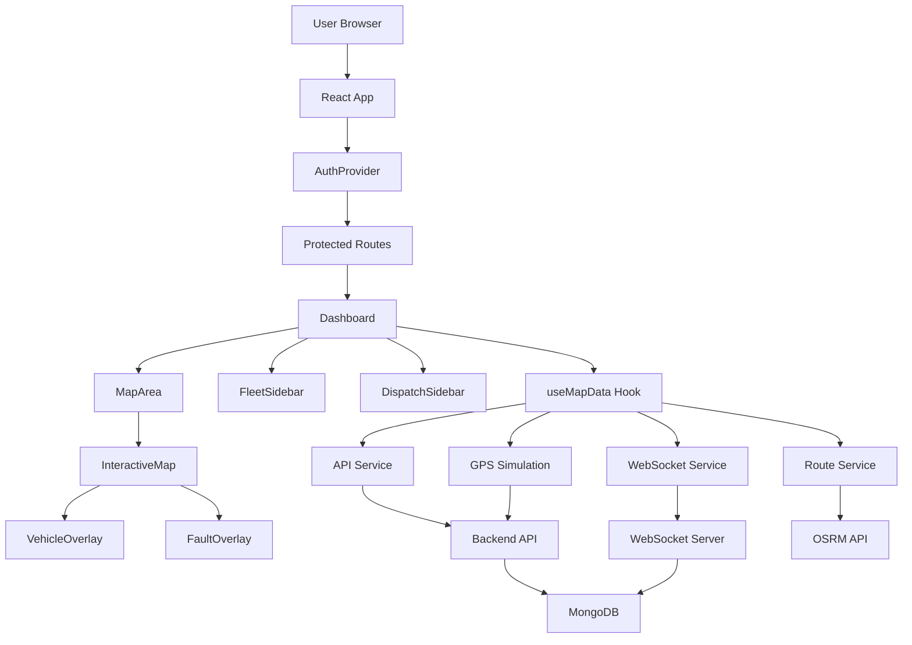

### Data Flow

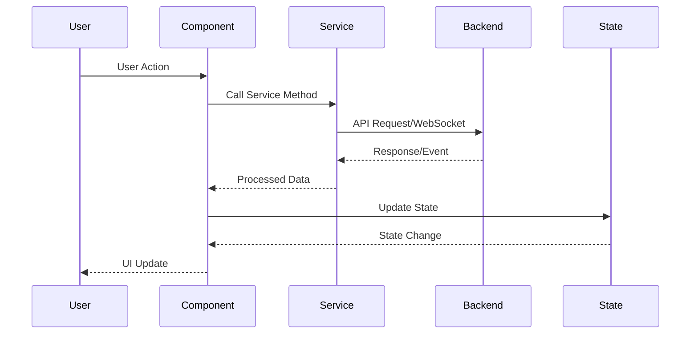

---

## Pages

### Dashboard Page Flow

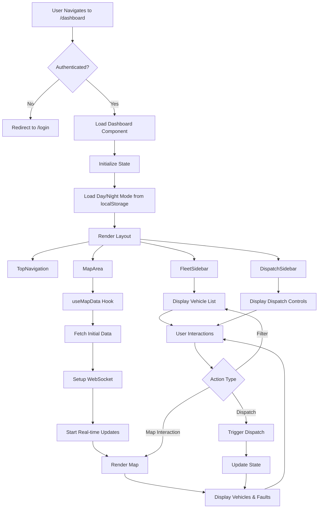

### Dashboard (`/dashboard`)
Main dashboard with map, vehicle list, and dispatch controls.

**State**: vehicles[], faults[], isDayMode, isPlaying, speed

### Login (`/login`)
Email/password authentication with validation.

### Signup (`/signup`)
Registration with username, email, password validation and strength indicator.

---

## Components

### FleetSidebar
- Vehicle list with status filters (available, dispatched, working, idle)
- Search functionality
- Fleet statistics
- Collapsible design

### DispatchSidebar
- AI dispatch toggle
- Dispatch activity logs
- Fault list with assignment status
- Manual dispatch controls

### InteractiveMap
- MapLibre GL map with OpenStreetMap tiles
- Center: Karachi (67.0039°E, 24.8615°N)
- Zoom: 11 (initial), max 19
- Performance optimizations (tile caching, crisp rendering)

### VehicleOverlay
- Vehicle markers with status colors
- Vehicle number labels
- Click handlers

### FaultOverlay
- Fault markers with severity colors (critical/medium/low)
- Fault details on click
- Manual dispatch button

---

## Services

### API Request Flow

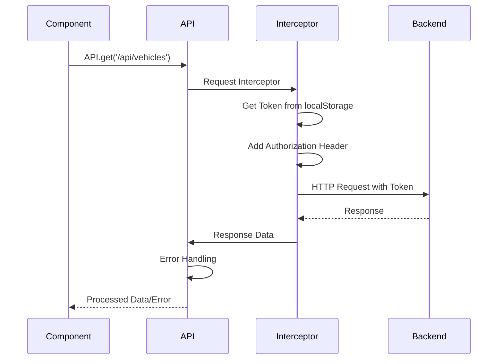

### Dispatch Service Flow

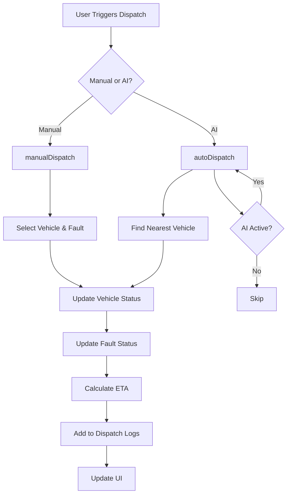

### AI Dispatch Service (`aiDispatchService.ts`)
Singleton service:
- `manualDispatch()`: Manual vehicle assignment
- `autoDispatch()`: Automatic dispatch logic
- `getDispatchLogs()`: Activity logs
- `toggleAI()`: Enable/disable AI

### Route Service (`routeService.ts`)
- OSRM route calculation
- Route caching
- Returns: waypoints, distance, duration

### GPS Simulation Service (`gpsSimulationService.ts`)
- Position calculation along routes
- Speed: 60 km/h (16.67 m/s)
- GPS updates to backend every 2-3 seconds

### Socket Service (`socketService.ts`)
- Socket.io client initialization
- Auto-reconnection
- Connection status tracking

---

## Hooks

### useWebSocket
WebSocket integration with handlers:
- `onVehicleGPSUpdate`
- `onVehicleStatusChange`
- `onFaultCreated/Updated`
- `onFaultDispatched`
- Returns: `{ socket, isConnected, connect, disconnect }`

### useMapData
Map data management:
- Fetches vehicles and faults
- Real-time WebSocket updates
- Route calculation on dispatch
- GPS simulation
- Returns: `{ vehicles, faults, handleManualDispatch }`

---

## Contexts

### AuthContext
- User data and JWT token
- `login()`, `register()`, `logout()`
- Persistence in localStorage
- Auto token injection

---

## Routing

### Routing Flow

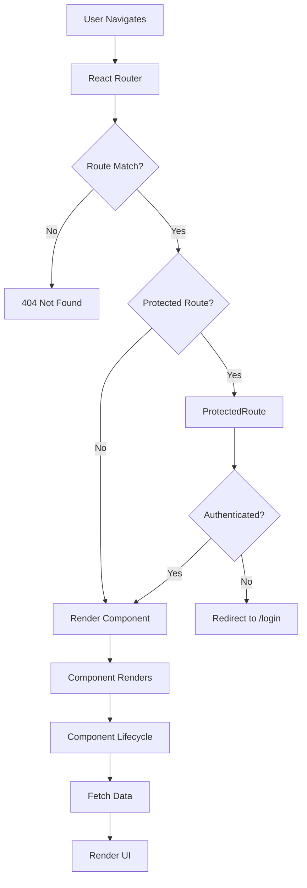

### Route Protection Flow

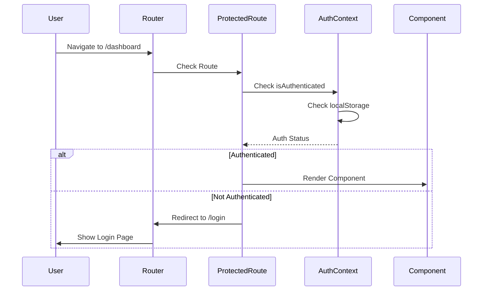

**Routes**:
- `/` - Index
- `/login` - Login page
- `/signup` - Signup page
- `/dashboard` - Dashboard (protected)
- `/maintenance` - Maintenance (protected)
- `/maintenance/:vehicleId` - Details (protected)
- `*` - 404

**Protected Routes**: Wrapped in `ProtectedRoute` component

---

## Real-time Communication

### WebSocket Connection Flow

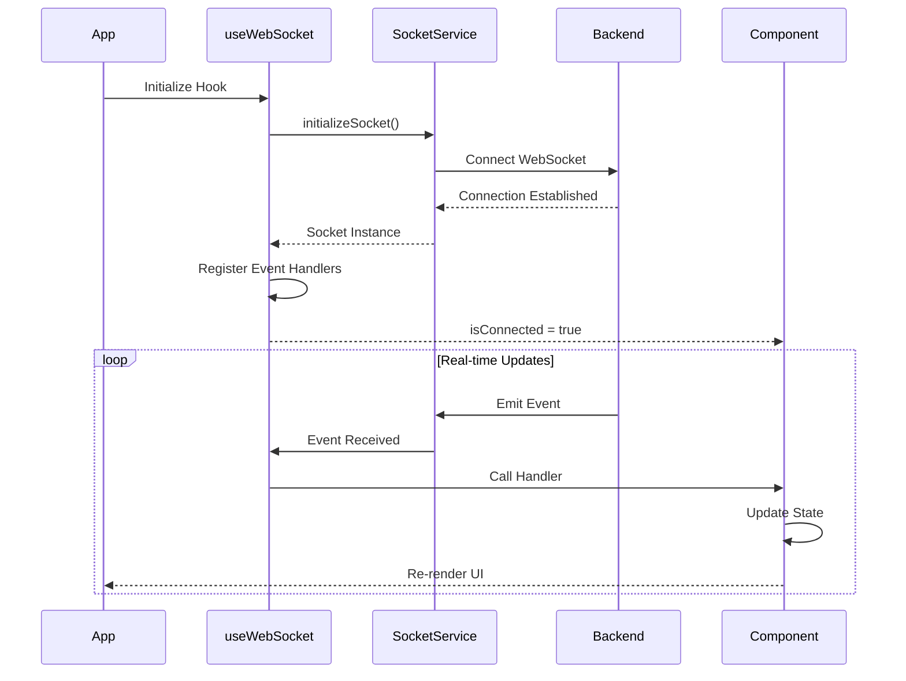

### Real-time Update Flow

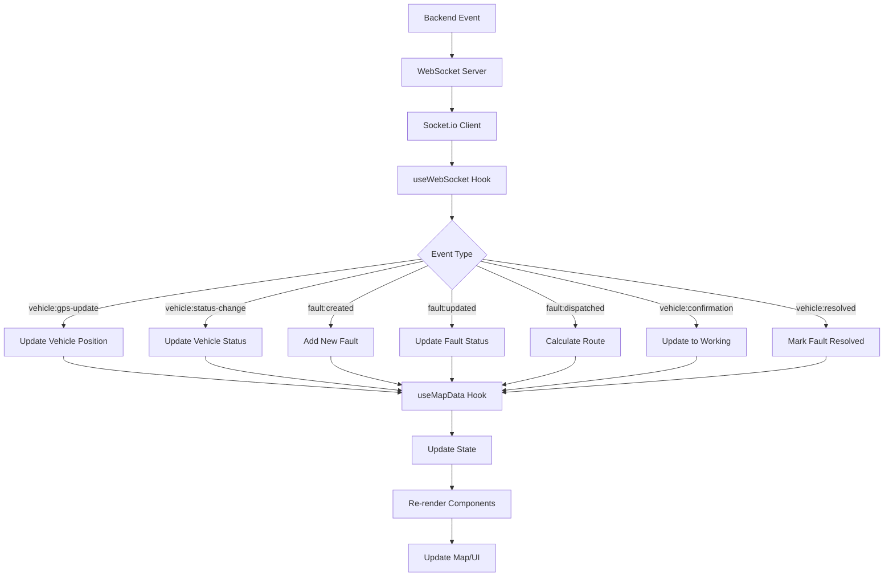

### WebSocket Events
- `vehicle:gps-update` - GPS coordinates
- `vehicle:status-change` - Status updates
- `fault:created` - New faults
- `fault:updated` - Fault changes
- `fault:dispatched` - Dispatch events
- `vehicle:confirmation` - Vehicle confirmed
- `vehicle:resolved` - Fault resolved

**Implementation**: `useWebSocket` hook + `socketService.ts`

---

## Map Integration

### MapLibre GL
- Library: MapLibre GL JS 3.6.2
- Tiles: OpenStreetMap
- Performance: Tile cache (50), crisp rendering, no fade

### OSRM Routing
- API: `https://router.project-osrm.org/route/v1/driving`
- Returns waypoints along actual roads
- Caching to reduce API calls

### Vehicle Movement
- Speed: 60 km/h
- Route-based (follows roads)
- GPS updates: Every 2-3 seconds
- Smooth interpolation along route segments

### Coordinates
- Format: [latitude, longitude]
- Karachi bounds: 24.8-24.95°N, 66.9-67.2°E
- Center: 24.8615°N, 67.0039°E

---

## Authentication

### Authentication Flow

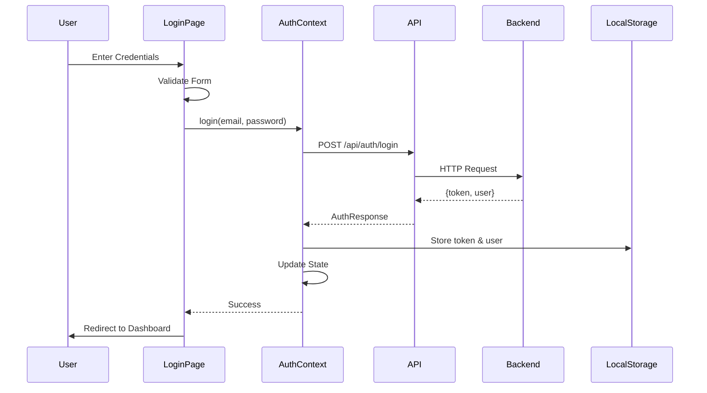

### Registration Flow

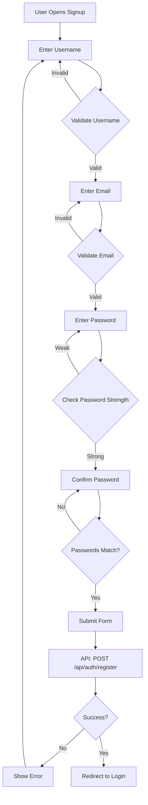

### Token Management Flow

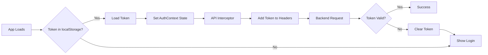

### Token Management Details
- Storage: `localStorage.authToken`
- User: `localStorage.authUser` (JSON)
- Injection: Axios interceptor

---

## Development Setup

### Prerequisites
- Node.js 18+
- Backend API running

### Installation
```bash
cd frontend
npm install
```

### Environment Variables
Create `.env`:
```env
VITE_API_URL=http://localhost:5000
```

### Development
```bash
npm run dev
# Server: http://localhost:5173
```

### Build
```bash
npm run build        # Production
npm run build:dev    # Development
npm run preview      # Preview build
```

---

## Build & Deployment

### Production Build
```bash
npm run build
# Output: dist/
```

### Docker
```yaml
frontend:
  build: ./frontend
  ports: ["5173:5173"]
  env_file: [./frontend/.env]
  environment:
    - VITE_API_URL=http://backend:5000
```

---

## Configuration

### Vite (`vite.config.ts`)
- Port: 5173
- Host: 0.0.0.0 (Docker)
- Strict Port: true
- Watch: Polling (Docker)
- Alias: `@` → `./src`

### TypeScript (`tsconfig.json`)
- Alias: `@/*` → `./src/*`
- Strict: Disabled

---

## Troubleshooting

### API Connection Failed
- Check `VITE_API_URL`
- Verify backend running
- Check CORS

### WebSocket Failed
- Verify backend WebSocket server
- Check URL matches backend
- Check CORS for WebSocket

### Map Not Rendering
- Check MapLibre GL CSS imported
- Verify OpenStreetMap tiles accessible
- Check console for errors

### Vehicles Not Moving
- Check GPS simulation running
- Verify route calculation
- Check WebSocket GPS events

### Authentication Issues
- Clear localStorage
- Verify JWT_SECRET matches backend
- Check token expiration

---

**Version**: 1.0.0  
**Last Updated**: January 2025  
**Status**: Production Ready
