# Flow Diagrams - Fleet Management System

This document contains all flow diagrams from the system documentation, formatted in Mermaid syntax for easy PNG export from [Mermaid Live Editor](https://mermaid.live) or [Mermaid CLI](https://github.com/mermaid-js/mermaid-cli).

---

## Backend Diagrams

### 1. High-Level Architecture

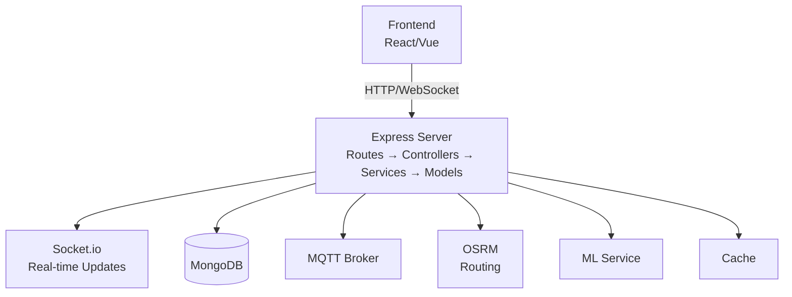

---

### 2. Fault Reporting and Dispatch Flow

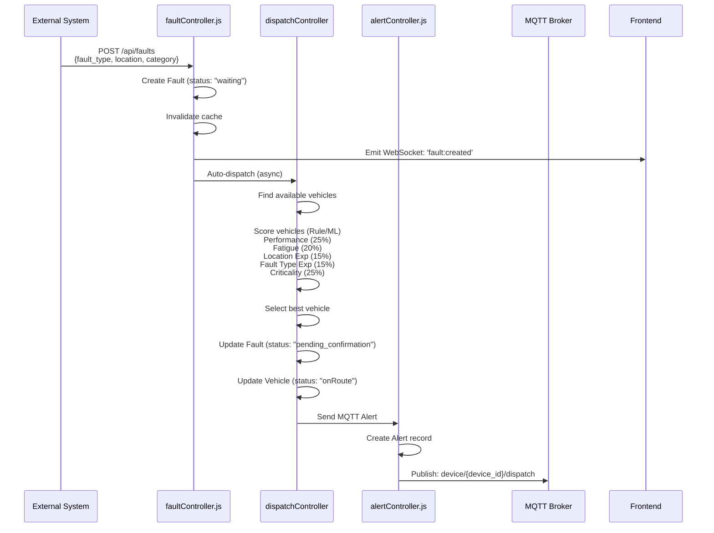

---

### 3. Driver Confirmation Flow

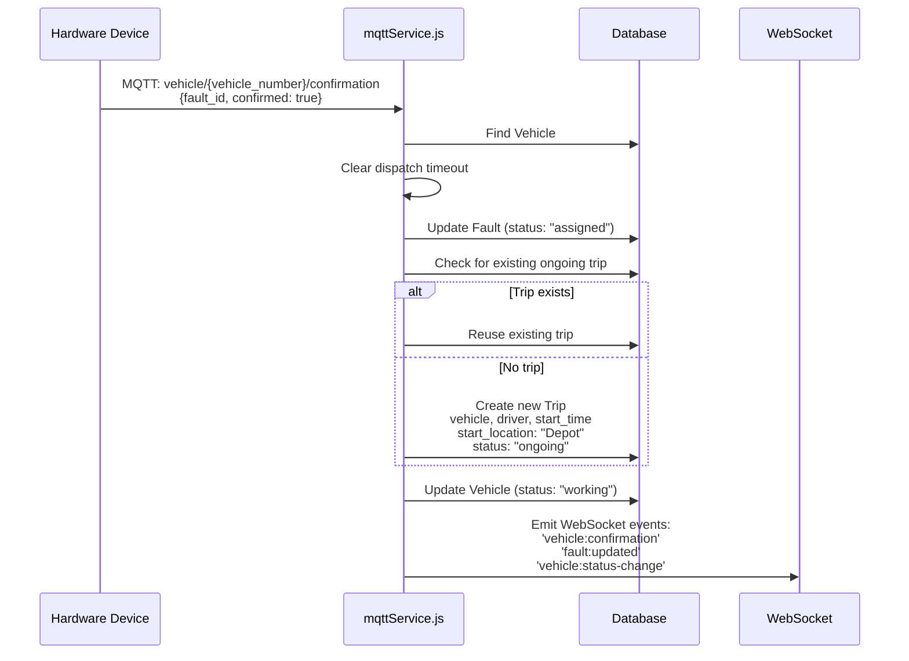

---

### 4. GPS Tracking and Arrival Detection Flow

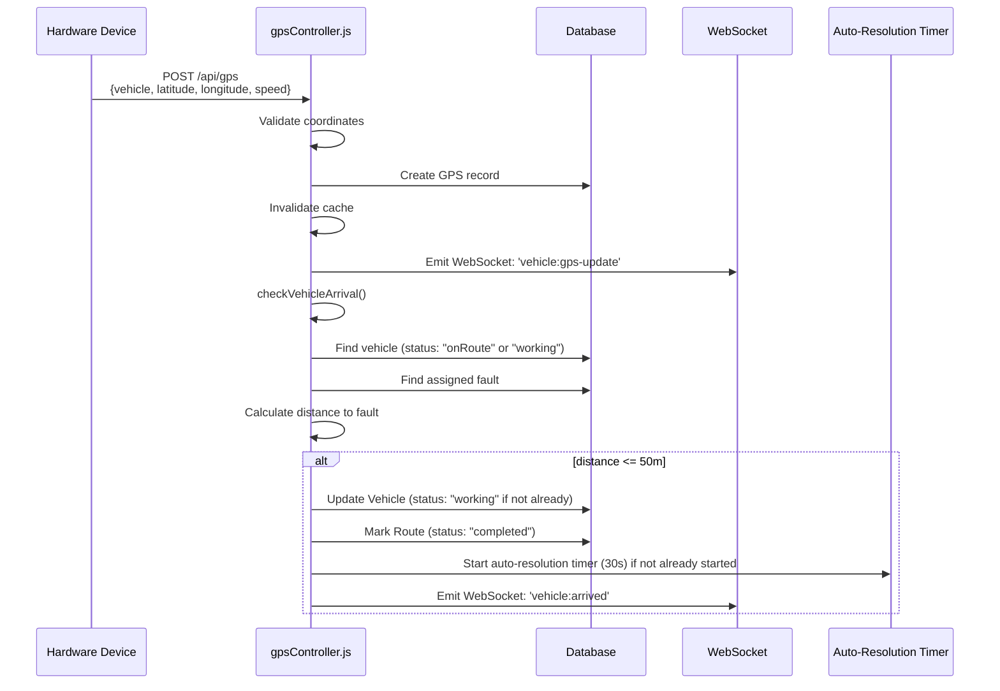

---

### 5. Fault Resolution Flow

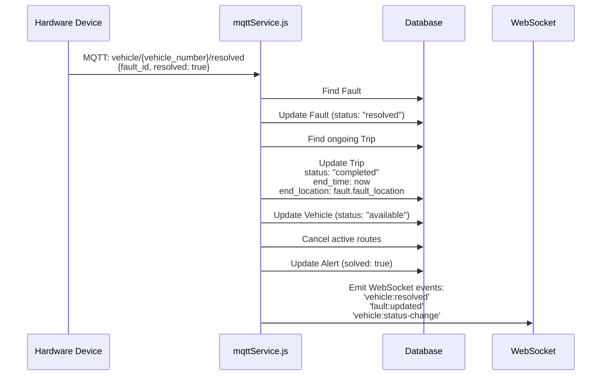

---

### 6. Auto-Resolution Timer Flow (Prototype Mode)

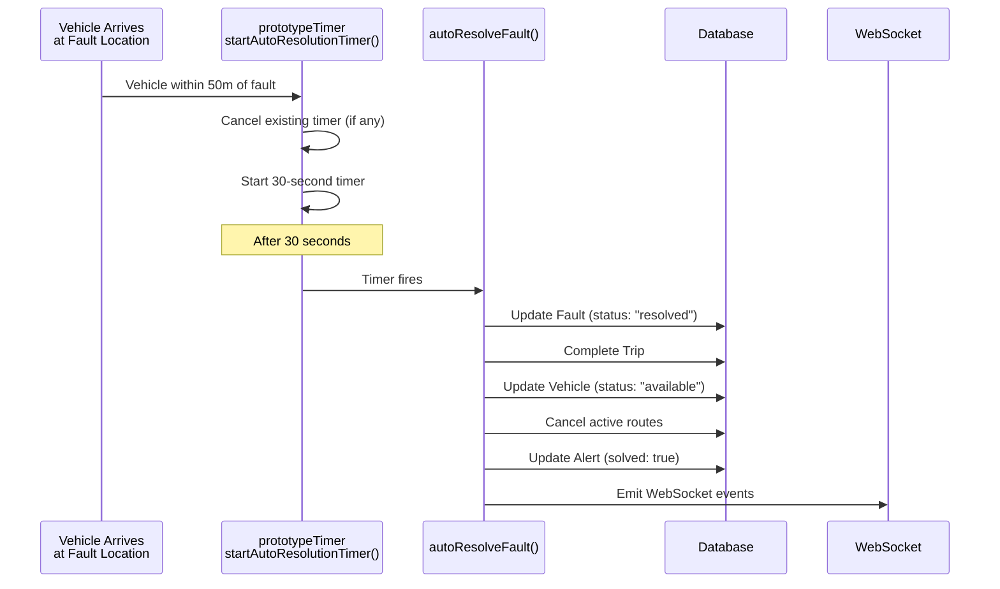

---

### 7. Route Recalculation Flow

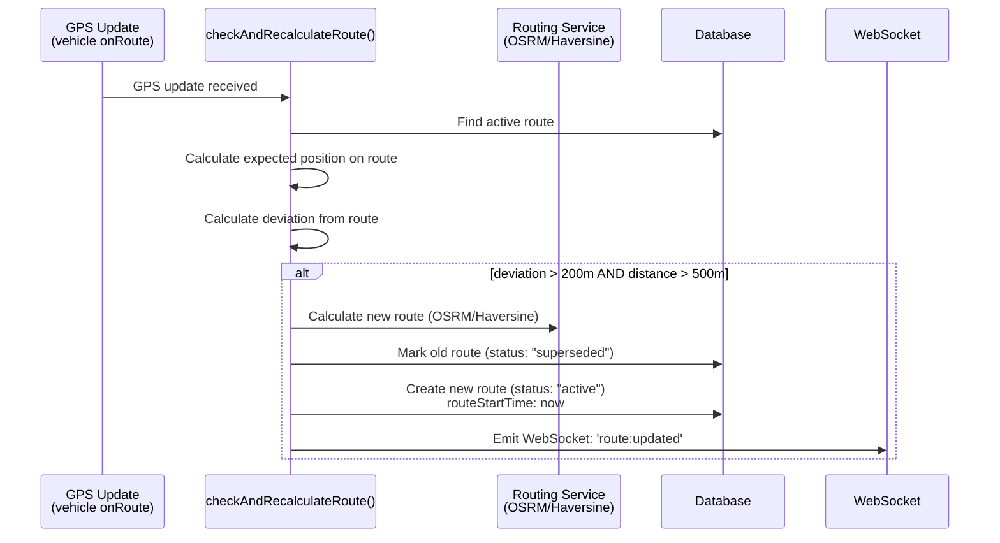

---

### 8. Dispatch Timeout Flow

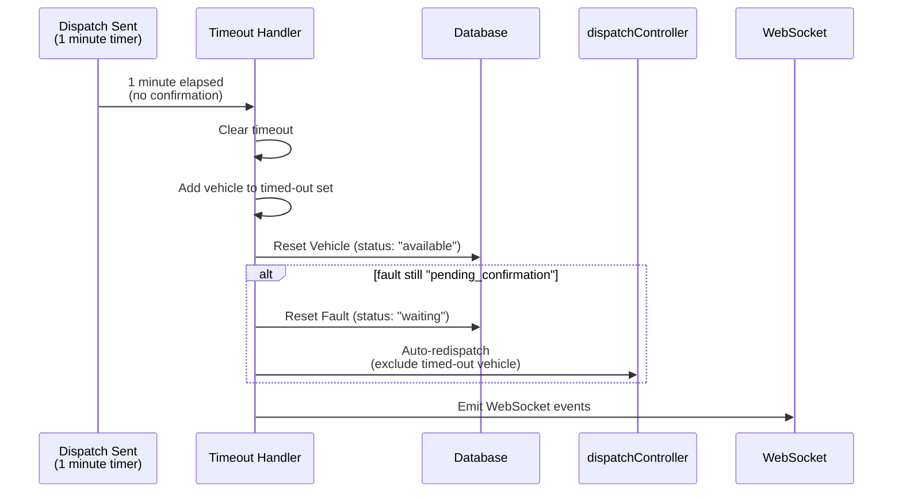

---

### 9. Stuck Vehicle Cleanup Flow

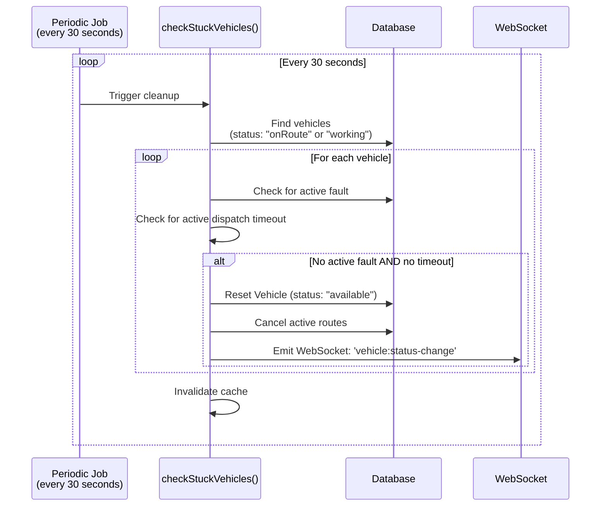

---

## Frontend Diagrams

### 10. High-Level Architecture (Frontend)

```mermaid
graph TB
    subgraph ReactApp["React Application"]
        Pages[Pages (Routes)<br/>Dashboard, Login, Signup, etc.]
        Components[Components<br/>Dashboard, Map, Sidebars, UI]
        Services[Services<br/>API, WebSocket, Route, GPS Simulation]
        Contexts[Contexts & Hooks<br/>AuthContext, useWebSocket, etc.]
    end
    
    BackendAPI[Backend API<br/>(REST)]
    WebSocket[WebSocket<br/>(Socket.io)]
    
    Pages --> Components
    Components --> Services
    Components --> Contexts
    Services --> BackendAPI
    Services --> WebSocket
```

---

### 11. Component Hierarchy

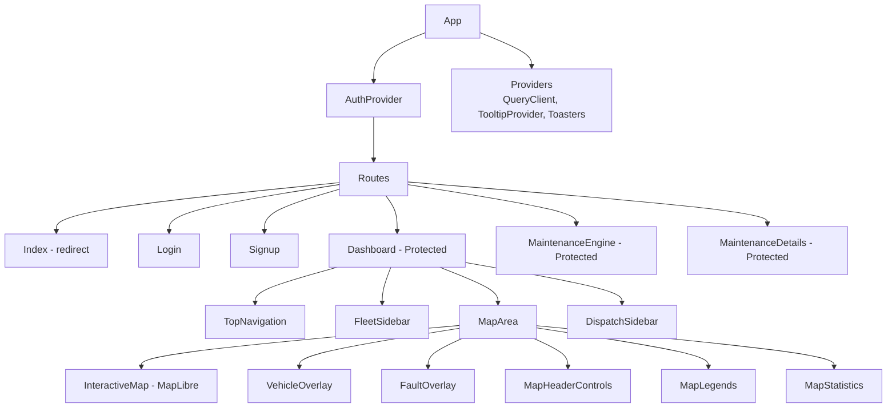

---

### 12. State Flow

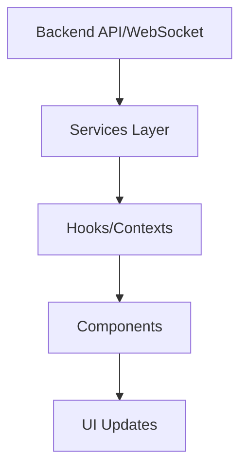

---

### 13. Event Flow (WebSocket)

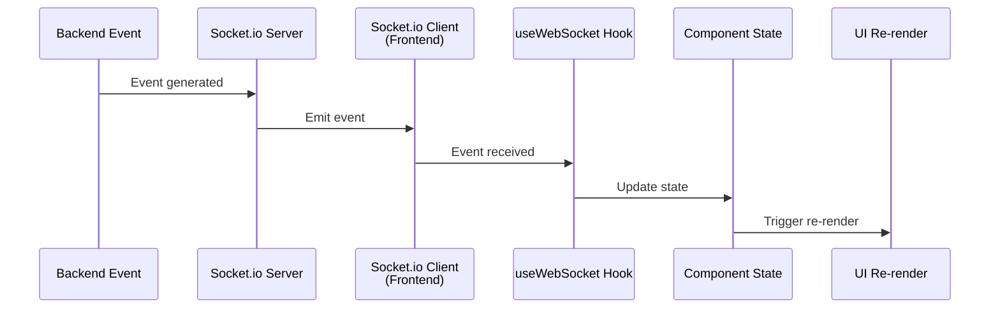

---

### 14. Vehicle Data Flow

```mermaid
graph LR
    BackendAPI[Backend API]
    APIService[getVehicles()<br/>API service]
    useMapData[useMapData hook]
    VehiclesState[vehicles state]
    VehicleOverlay[VehicleOverlay component]
    MapMarkers[Map markers]
    
    BackendAPI --> APIService
    APIService --> useMapData
    useMapData --> VehiclesState
    VehiclesState --> VehicleOverlay
    VehicleOverlay --> MapMarkers
```

---

### 15. Fault Data Flow

```mermaid
graph LR
    Backend[Backend API / WebSocket]
    GetFaults[getFaults() / fault:created event]
    useMapData[useMapData hook]
    FaultsState[faults state]
    FaultOverlay[FaultOverlay component]
    MapMarkers[Map markers + dispatch buttons]
    
    Backend --> GetFaults
    GetFaults --> useMapData
    useMapData --> FaultsState
    FaultsState --> FaultOverlay
    FaultOverlay --> MapMarkers
```

---

### 16. Dispatch Flow (Complete)

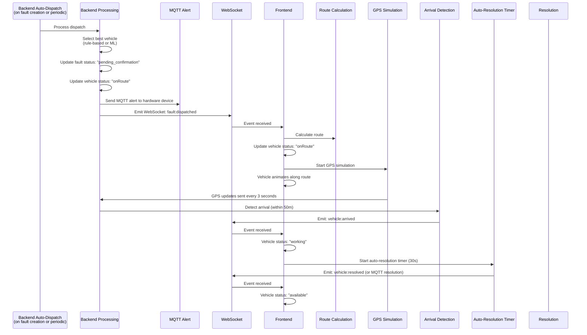

---

## How to Use These Diagrams

### Option 1: Mermaid Live Editor (Recommended)
1. Go to [https://mermaid.live](https://mermaid.live)
2. Copy any diagram code block (without the markdown code fence)
3. Paste it into the editor
4. Click "Actions" → "Download PNG" or "Download SVG"

### Option 2: Mermaid CLI
1. Install Mermaid CLI:
   ```bash
   npm install -g @mermaid-js/mermaid-cli
   ```
2. Save a diagram to a `.mmd` file
3. Generate PNG:
   ```bash
   mmdc -i diagram.mmd -o diagram.png
   ```

### Option 3: VS Code Extension
1. Install "Markdown Preview Mermaid Support" extension
2. Open this file in VS Code
3. Use the preview to view diagrams
4. Export as needed

---

## Diagram Index

| # | Diagram Name | Type | Location |
|---|-------------|------|----------|
| 1 | High-Level Architecture (Backend) | Graph | Backend Documentation |
| 2 | Fault Reporting and Dispatch Flow | Sequence | Backend Documentation |
| 3 | Driver Confirmation Flow | Sequence | Backend Documentation |
| 4 | GPS Tracking and Arrival Detection Flow | Sequence | Backend Documentation |
| 5 | Fault Resolution Flow | Sequence | Backend Documentation |
| 6 | Auto-Resolution Timer Flow | Sequence | Backend Documentation |
| 7 | Route Recalculation Flow | Sequence | Backend Documentation |
| 8 | Dispatch Timeout Flow | Sequence | Backend Documentation |
| 9 | Stuck Vehicle Cleanup Flow | Sequence | Backend Documentation |
| 10 | High-Level Architecture (Frontend) | Graph | Frontend Documentation |
| 11 | Component Hierarchy | Graph | Frontend Documentation |
| 12 | State Flow | Graph | Frontend Documentation |
| 13 | Event Flow (WebSocket) | Sequence | Frontend Documentation |
| 14 | Vehicle Data Flow | Graph | Frontend Documentation |
| 15 | Fault Data Flow | Graph | Frontend Documentation |
| 16 | Dispatch Flow (Complete) | Sequence | Frontend Documentation |

---

**Note**: All diagrams are formatted in standard Mermaid syntax and can be directly used with Mermaid-compatible tools for PNG/SVG export.
